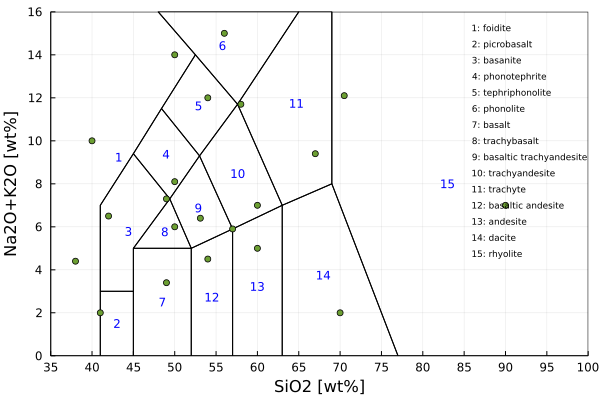

---
---

# TAS rock classification {#TAS-rock-classification}

## Methods {#Methods}

When doing coupled petrological-geodynamic modelling, the evolution of the composition of the magma is more easily understood when a rock type is given. This routine is an implementation of the TAS diagram (Total Alkali (TA) vs Silica (S)) from Le Maitre et al., 2002.
<details class='jldocstring custom-block' open>
<summary><a id='GeoParams.TASclassification.TASclassificationData' href='#GeoParams.TASclassification.TASclassificationData'><span class="jlbinding">GeoParams.TASclassification.TASclassificationData</span></a> <Badge type="info" class="jlObjectType jlType" text="Type" /></summary>


```julia
TASclassificationData

Struct that holds default parameters for the TAS diagram
```


<Badge type="info" class="source-link" text="source"><a href="https://github.com/JuliaGeodynamics/GeoParams.jl/blob/68ac1af6736097999812363ccbc1c6ec744384f3/src/RockClassification/TASclassification.jl#L47-L51" target="_blank" rel="noreferrer">source</a></Badge>

</details>


## Computational routine {#Computational-routine}

There is one routine with which you can retrieve the index of the TAS rock-type. The routine receives as an input a compositional vector [SiO2,Na2O+K2O] in wt% and sends back an index [1-15].
<details class='jldocstring custom-block' open>
<summary><a id='GeoParams.TASclassification.computeTASclassification' href='#GeoParams.TASclassification.computeTASclassification'><span class="jlbinding">GeoParams.TASclassification.computeTASclassification</span></a> <Badge type="info" class="jlObjectType jlFunction" text="Function" /></summary>


classIndex computeTASclassification(chemComp::AbstractArray{_T,N}, ClassTASdata::TASclassificationData)

This compute the classification of the igneous rock using TAS diagram (Total Alkali (TA) vs Silica (S)).

**Input:**
- `chemComp` : vector rock composition in oxide wt%
  

Output:
- `classIndex` : an integer [0-14] corresponding to a TAS field (TASclassificationData.litho[classIndex])
  

This routine was developed based the TAS classification of Le Maitre et al., 2002


<Badge type="info" class="source-link" text="source"><a href="https://github.com/JuliaGeodynamics/GeoParams.jl/blob/68ac1af6736097999812363ccbc1c6ec744384f3/src/RockClassification/TASclassification.jl#L113-L127" target="_blank" rel="noreferrer">source</a></Badge>

</details>


Using the index of the rock-type you can get the name of the corresponding volcanic rock using the following routine.
<details class='jldocstring custom-block' open>
<summary><a id='GeoParams.TASclassification.retrieveTASrockType' href='#GeoParams.TASclassification.retrieveTASrockType'><span class="jlbinding">GeoParams.TASclassification.retrieveTASrockType</span></a> <Badge type="info" class="jlObjectType jlFunction" text="Function" /></summary>


retrieveTASrockType(index::Int64; ClassTASdata::TASclassificationData = TASclassificationData())

This retrieves the name of the volcanic rock-type using the computed index

**Input:**
- `index` : integer [1-15]
  

Output:
- `litho` : a string of the name of corresponding volcanic rock
  


<Badge type="info" class="source-link" text="source"><a href="https://github.com/JuliaGeodynamics/GeoParams.jl/blob/68ac1af6736097999812363ccbc1c6ec744384f3/src/RockClassification/TASclassification.jl#L93-L105" target="_blank" rel="noreferrer">source</a></Badge>

</details>


We also provide a plotting routine, provided the GLMakie.jl package is loaded, which produces figures such as: 


