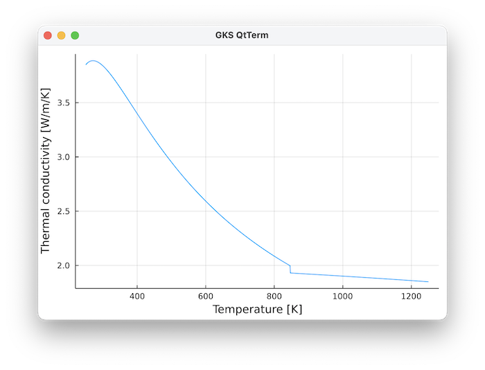
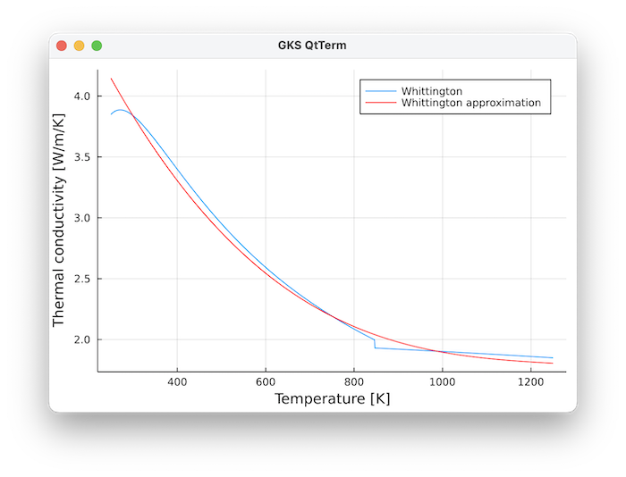

---
---

# Conductivity {#Conductivity}

## Methods {#Methods}

Thermal conductivity is defined as 
<details class='jldocstring custom-block' open>
<summary><a id='GeoParams.MaterialParameters.Conductivity.ConstantConductivity' href='#GeoParams.MaterialParameters.Conductivity.ConstantConductivity'><span class="jlbinding">GeoParams.MaterialParameters.Conductivity.ConstantConductivity</span></a> <Badge type="info" class="jlObjectType jlType" text="Type" /></summary>


```julia
ConstantConductivity(k=3.0W/m/K)
```


Set a constant conductivity

$$    k  = cst$$

where $k$ is the thermal conductivity [$W/m/K$].


<Badge type="info" class="source-link" text="source"><a href="https://github.com/JuliaGeodynamics/GeoParams.jl/blob/68ac1af6736097999812363ccbc1c6ec744384f3/src/Energy/Conductivity.jl#L28-L36" target="_blank" rel="noreferrer">source</a></Badge>

</details>

<details class='jldocstring custom-block' open>
<summary><a id='GeoParams.MaterialParameters.Conductivity.T_Conductivity_Whittington' href='#GeoParams.MaterialParameters.Conductivity.T_Conductivity_Whittington'><span class="jlbinding">GeoParams.MaterialParameters.Conductivity.T_Conductivity_Whittington</span></a> <Badge type="info" class="jlObjectType jlType" text="Type" /></summary>


```julia
T_Conductivity_Whittington()
```


Sets a temperature-dependent conductivity following the parameterization of _Whittington, A.G., Hofmeister, A.M., Nabelek, P.I., 2009. Temperature-dependent thermal diffusivity of the Earth’s crust and implications for magmatism. Nature 458, 319–321. https://doi.org/10.1038/nature07818._ Their parameterization is originally given for the thermal diffusivity, together with a parameterization for thermal conductivity, which allows us to compute

$$    Cp = a + b T - c/T^2$$

$$    \kappa = d/T - e \textrm{ if } T<=846K$$

$$    \kappa = f - g*T \textrm{ if } T>846K$$

$$    \rho = 2700 kg/m^3$$

$$    k = \kappa \rho Cp$$

where $Cp$ is the heat capacity [$J/mol/K$], and $a,b,c$ are parameters that dependent on the temperature `T`:
- a = 199.50 J/mol/K    if T&lt;= 846 K
  
- a = 199.50 J/mol/K    if T&gt; 846 K
  
- b = 0.0857J/mol/K^2   if T&lt;= 846 K
  
- b = 0.0323J/mol/K^2   if T&gt; 846 K
  
- c = 5e6J/mol*K        if T&lt;= 846 K
  
- c = 47.9e-6J/mol*K    if T&gt; 846 K
  
- d = 576.3m^2/s*K
  
- e = 0.062m^2/s
  
- f = 0.732m^2/s
  
- g = 0.000135m^2/s/K
  

This looks like:





**Example**

```julia
julia> using GLMakie, GeoParams
julia> p=T_Conductivity_Whittington();
julia> T,k,plt = PlotConductivity(p)
```


<Badge type="info" class="source-link" text="source"><a href="https://github.com/JuliaGeodynamics/GeoParams.jl/blob/68ac1af6736097999812363ccbc1c6ec744384f3/src/Energy/Conductivity.jl#L83-L129" target="_blank" rel="noreferrer">source</a></Badge>

</details>

<details class='jldocstring custom-block' open>
<summary><a id='GeoParams.MaterialParameters.Conductivity.T_Conductivity_Whittington_parameterised' href='#GeoParams.MaterialParameters.Conductivity.T_Conductivity_Whittington_parameterised'><span class="jlbinding">GeoParams.MaterialParameters.Conductivity.T_Conductivity_Whittington_parameterised</span></a> <Badge type="info" class="jlObjectType jlType" text="Type" /></summary>


```julia
T_Conductivity_Whittington_parameterised()
```


Sets a temperature-dependent conductivity that is  parameterization after _Whittington, et al.  2009_

The original parameterization involves quite a few parameters; this is a polynomial fit that is roughly valid from 0-1000 Celsius

$$    k [W/m/K] = -2 10^{-9} (T-Ts)^3 + 6 10^{-6} (T-Ts)^2 - 0.0062 (T-Ts) + 4$$

$$    Ts = 273.15 K$$

where `T[K]` is the temperature in Kelvin (or the nondimensional equivalent of it).

The comparison of this parameterisation vs. the original one is: 



<Badge type="info" class="source-link" text="source"><a href="https://github.com/JuliaGeodynamics/GeoParams.jl/blob/68ac1af6736097999812363ccbc1c6ec744384f3/src/Energy/Conductivity.jl#L217-L235" target="_blank" rel="noreferrer">source</a></Badge>

</details>

<details class='jldocstring custom-block' open>
<summary><a id='GeoParams.MaterialParameters.Conductivity.TP_Conductivity' href='#GeoParams.MaterialParameters.Conductivity.TP_Conductivity'><span class="jlbinding">GeoParams.MaterialParameters.Conductivity.TP_Conductivity</span></a> <Badge type="info" class="jlObjectType jlType" text="Type" /></summary>


```julia
TP_Conductivity()
```


Sets a temperature (and pressure)-dependent conductivity parameterization as described in Gerya, Numerical Geodynamics (2nd edition, Table 21.2). The general for

$$    k = \left( a_k +  \frac{b_k}{T + c_k} \right) (1 + d_k P)$$

where $k$ is the conductivity [$W/K/m$], and $a_k,b_k,c_k,d_k$ are parameters that dependent on the temperature `T` and pressure `P`:
- $a_k$ = 1.18Watt/K/m
  
- $b_k$ = 474Watt/m
  
- $c_k$ = 77K
  
- $d_k$ = 0/MPa
  


<Badge type="info" class="source-link" text="source"><a href="https://github.com/JuliaGeodynamics/GeoParams.jl/blob/68ac1af6736097999812363ccbc1c6ec744384f3/src/Energy/Conductivity.jl#L308-L323" target="_blank" rel="noreferrer">source</a></Badge>

</details>

<details class='jldocstring custom-block' open>
<summary><a id='GeoParams.MaterialParameters.Conductivity.Set_TP_Conductivity' href='#GeoParams.MaterialParameters.Conductivity.Set_TP_Conductivity'><span class="jlbinding">GeoParams.MaterialParameters.Conductivity.Set_TP_Conductivity</span></a> <Badge type="info" class="jlObjectType jlFunction" text="Function" /></summary>


```julia
Set_TP_Conductivity["Name of temperature(-pressure) dependent conductivity"]
```


This is a dictionary with pre-defined laws:
- "UpperCrust"
  
- "LowerCrust"
  
- "OceanicCrust"
  
- "Mantle"
  

**Example**

```julia
julia> k=Set_TP_Conductivity["Mantle"]
T/P dependent conductivity: k = (0.73 W K⁻¹ m⁻¹ + 1293 W m⁻¹/(T + 77 K))*(1 + 4.0e-5 MPa⁻¹*P)
```


<Badge type="info" class="source-link" text="source"><a href="https://github.com/JuliaGeodynamics/GeoParams.jl/blob/68ac1af6736097999812363ccbc1c6ec744384f3/src/Energy/Conductivity.jl#L358-L373" target="_blank" rel="noreferrer">source</a></Badge>

</details>


## Computational routines {#Computational-routines}

To compute, use this:
<details class='jldocstring custom-block' open>
<summary><a id='GeoParams.MaterialParameters.Conductivity.compute_conductivity' href='#GeoParams.MaterialParameters.Conductivity.compute_conductivity'><span class="jlbinding">GeoParams.MaterialParameters.Conductivity.compute_conductivity</span></a> <Badge type="info" class="jlObjectType jlFunction" text="Function" /></summary>


```julia
k = compute_conductivity(P, T, s:<AbstractConductivity)
```


Returns the thermal conductivity `k` at any temperature `T` and pressure `P` using any of the parameterizations implemented.

Currently available:
- ConstantConductivity
  
- T_Conductivity_Whittington
  
- TP_Conductivity
  

**Example**

Using dimensional units

```julia
julia> T  = (250:100:1250)*K;
julia> cp = T_HeatCapacity_Whittington()
julia> Cp = ComputeHeatCapacity(0,T,cp)
```


<Badge type="info" class="source-link" text="source"><a href="https://github.com/JuliaGeodynamics/GeoParams.jl/blob/68ac1af6736097999812363ccbc1c6ec744384f3/src/Energy/Conductivity.jl#L500-L519" target="_blank" rel="noreferrer">source</a></Badge>


```julia
compute_conductivity!(K::AbstractArray{<:AbstractFloat}, Phases::AbstractArray{<:Integer}, P::AbstractArray{<:AbstractFloat},Temp::AbstractArray{<:AbstractFloat}, MatParam::AbstractArray{<:AbstractMaterialParamsStruct})
```


In-place computation of conductivity `K` for the whole domain and all phases, in case a vector with phase properties `MatParam` is provided, along with `P` and `Temp` arrays. This assumes that the `Phase` of every point is specified as an Integer in the `Phases` array.

_________________________________________________________________________________________________________

compute_conductivity!(k::AbstractArray{T,N}, PhaseRatios::AbstractArray{T, M}, P::AbstractArray{&lt;:AbstractFloat,N},T::AbstractArray{&lt;:AbstractFloat,N}, MatParam::AbstractArray{&lt;:AbstractMaterialParamsStruct})

In-place computation of conductivity `k` for the whole domain and all phases, in case a vector with phase properties `MatParam` is provided, along with `P` and `T` arrays. This assumes that the `PhaseRatio` of every point is specified as an Integer in the `PhaseRatios` array, which has one dimension more than the data arrays (and has a phase fraction between 0-1)


<Badge type="info" class="source-link" text="source"><a href="https://github.com/JuliaGeodynamics/GeoParams.jl/blob/68ac1af6736097999812363ccbc1c6ec744384f3/src/Energy/Conductivity.jl#L541-L553" target="_blank" rel="noreferrer">source</a></Badge>

</details>

<details class='jldocstring custom-block' open>
<summary><a id='GeoParams.MaterialParameters.Conductivity.compute_conductivity!' href='#GeoParams.MaterialParameters.Conductivity.compute_conductivity!'><span class="jlbinding">GeoParams.MaterialParameters.Conductivity.compute_conductivity!</span></a> <Badge type="info" class="jlObjectType jlFunction" text="Function" /></summary>


```julia
compute_conductivity(k_array::AbstractArray{<:AbstractFloat,N},P::AbstractArray{<:AbstractFloat,N},T::AbstractArray{<:AbstractFloat,N}, s::ConstantConductivity) where N
```


In-place routine to compute constant conductivity


<Badge type="info" class="source-link" text="source"><a href="https://github.com/JuliaGeodynamics/GeoParams.jl/blob/68ac1af6736097999812363ccbc1c6ec744384f3/src/Energy/Conductivity.jl#L63-L67" target="_blank" rel="noreferrer">source</a></Badge>

</details>

