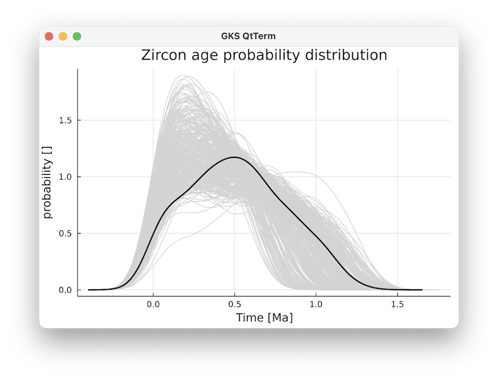

---
---

# Zircon age parameterizations {#Zircon-age-parameterizations}

## Methods {#Methods}

Zircons are one of the ways in which we can date the age & activity of magmatic systems. Here, we provide a computational routine that computes the zircon age distribution from temperature-time paths
<details class='jldocstring custom-block' open>
<summary><a id='GeoParams.ZirconAges.ZirconAgeData' href='#GeoParams.ZirconAges.ZirconAgeData'><span class="jlbinding">GeoParams.ZirconAges.ZirconAgeData</span></a> <Badge type="info" class="jlObjectType jlType" text="Type" /></summary>


```julia
ZirconAgeData
```


Struct that holds default parameters for the calculations


<Badge type="info" class="source-link" text="source"><a href="https://github.com/JuliaGeodynamics/GeoParams.jl/blob/68ac1af6736097999812363ccbc1c6ec744384f3/src/ZirconAge/ZirconAges.jl#L27-L31" target="_blank" rel="noreferrer">source</a></Badge>

</details>


## Computational routines {#Computational-routines}

There is one main routine with which you can compute zircon age probability density functions from a range of temperature-ime paths:
<details class='jldocstring custom-block' open>
<summary><a id='GeoParams.ZirconAges.compute_zircon_age_PDF' href='#GeoParams.ZirconAges.compute_zircon_age_PDF'><span class="jlbinding">GeoParams.ZirconAges.compute_zircon_age_PDF</span></a> <Badge type="info" class="jlObjectType jlFunction" text="Function" /></summary>


```julia
time_Ma, PDF_zircons, time_Ma_average, PDF_zircon_average, time_years, prob, ages_eruptible, number_zircons, T_av_time, T_sd_time, cumPDF = compute_zircon_age_PDF(time_years_vecs::Vector{Vector}, Tt_paths_Temp_vecs::Vector{Vector}; ZirconData::ZirconAgeData = ZirconAgeData(), bandwidth=bandwidth, n_analyses=300)
```


This computes the PDF (probability density function) with zircon age data from Vectors with Tt-paths	


<Badge type="info" class="source-link" text="source"><a href="https://github.com/JuliaGeodynamics/GeoParams.jl/blob/68ac1af6736097999812363ccbc1c6ec744384f3/src/ZirconAge/ZirconAges.jl#L296-L301" target="_blank" rel="noreferrer">source</a></Badge>

</details>


This, in turn, calls two other routines:
<details class='jldocstring custom-block' open>
<summary><a id='GeoParams.ZirconAges.compute_zircons_Ttpath' href='#GeoParams.ZirconAges.compute_zircons_Ttpath'><span class="jlbinding">GeoParams.ZirconAges.compute_zircons_Ttpath</span></a> <Badge type="info" class="jlObjectType jlFunction" text="Function" /></summary>


```julia
prob, ages_eruptible, number_zircons, T_av_time, T_sd_time, cumPDF =  compute_zircons_Ttpath(time_years::AbstractArray{Float64,1}, Tt_paths_Temp::AbstractArray{Float64,2}; ZirconData::ZirconAgeData)
```


This computes the number of zircons produced from a series of temperature-time path's.  The Tt-paths are stored in a 2D matrix `Tt_paths_Temp` with rows being the temperature at time `time_years`.

**Input:**
- `time_years` : vector of length `nt` with the time in years (since the beginning of the simulation) of the points provided
  
- `Tt_paths_Temp` : array of size `(nt,npaths)`` with the temperature of every path.
  

Output:
- `prob` : a vector that gives the relative probability that a zircon with a given age exists
  
- `ages_eruptible` : age of eruptble magma
  
- `number_zircons` : 1D array of size `(nt,)`
  
- `T_av_time`: vector of size `nt` that contains the average T of the paths
  
- `T_sd_time`: vector of size `nt` that contains the standard deviation of the T of the paths
  
- `cumPDF`: vector of size `nt` that contains the cumulative probability density function that we have an age of less than a certain one in the samples
  

This routine was developed based on an R-routine provided as electronic supplement in the paper:
- Weber, G., Caricchi, L., Arce, J.L., Schmitt, A.K., 2020. Determining the current size and state of subvolcanic magma reservoirs. Nat Commun 11, 5477. https://doi.org/10.1038/s41467-020-19084-2
  


<Badge type="info" class="source-link" text="source"><a href="https://github.com/JuliaGeodynamics/GeoParams.jl/blob/68ac1af6736097999812363ccbc1c6ec744384f3/src/ZirconAge/ZirconAges.jl#L98-L120" target="_blank" rel="noreferrer">source</a></Badge>


```julia
time_years, prob, ages_eruptible, number_zircons, T_av_time, T_sd_time, cumPDF  = compute_zircons_Ttpath(time_years_vecs::Vector{Vector{Float64}}, Tt_paths_Temp::Vector{Vector{Float64}}; ZirconData::ZirconAgeData = ZirconAgeData())
```


This accepts Vector{Vector} as input for time and temperature of each Tt-path. Here, the length of the vector can be variable between different points.

Internally, we interpolate this into a 2D matrix and a longer vector that includes all paths and a single vector with times 


<Badge type="info" class="source-link" text="source"><a href="https://github.com/JuliaGeodynamics/GeoParams.jl/blob/68ac1af6736097999812363ccbc1c6ec744384f3/src/ZirconAge/ZirconAges.jl#L205-L212" target="_blank" rel="noreferrer">source</a></Badge>

</details>

<details class='jldocstring custom-block' open>
<summary><a id='GeoParams.ZirconAges.zircon_age_PDF' href='#GeoParams.ZirconAges.zircon_age_PDF'><span class="jlbinding">GeoParams.ZirconAges.zircon_age_PDF</span></a> <Badge type="info" class="jlObjectType jlFunction" text="Function" /></summary>


```julia
zircon_age_PDF(ages_eruptible::AbstractArray{Float64,1}, number_zircons::AbstractArray{Float64,2}, bandwidth=1e5, n_analyses=300, ZirconData::ZirconAgeData)
```


Compute probability density functions for zircon age path's describes in `number_zircons` with age `ages_eruptible` (both computed ). `bandwidth` is the smoothening window of the resulting curves (in years), whereas `n_analyses` are the number of analyses done. 	


<Badge type="info" class="source-link" text="source"><a href="https://github.com/JuliaGeodynamics/GeoParams.jl/blob/68ac1af6736097999812363ccbc1c6ec744384f3/src/ZirconAge/ZirconAges.jl#L256-L260" target="_blank" rel="noreferrer">source</a></Badge>

</details>


We also provide a plotting routine, provided the GLMakie.jl package is loaded, which produces figures such as: 


