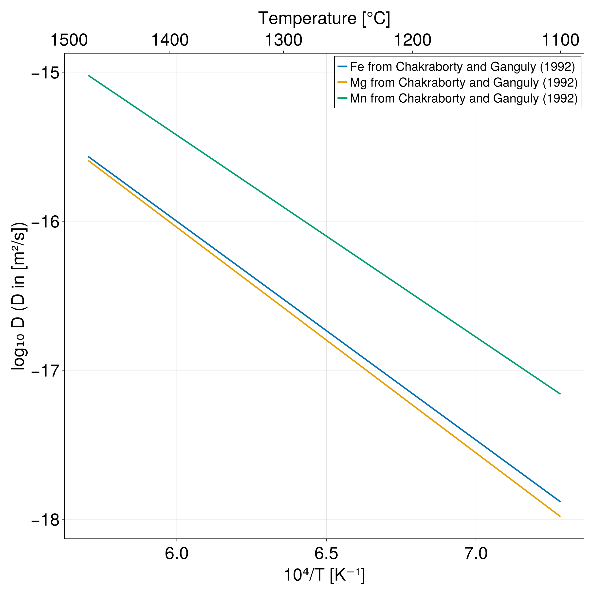

# Chemical Diffusion

Some routines and experimental data for chemical diffusion in minerals and phases are implemented in [GeoParams.jl](https://juliageodynamics.github.io/GeoParams.jl/stable/).

## Diffusion parameters from the literature

Currently, four phases are implemented in independent modules: `Rutile`, `Olivine`, `Garnet`, and `Melt`. Each phase has a list of diffusion parameters from the literature for different chemical elements. Other phases will be implemented in the future and contributions are welcome to extend the database.

To initiate the diffusion parameters of an element of a phase, call the function `SetChemicalDiffusion`. For instance, to obtain the diffusion parameters of Hf in rutile, use:

```julia
using GeoParams

Hf_Rt_para = Rutile.Rt_Hf_Cherniak2007_para_c
Hf_Rt_para = SetChemicalDiffusion(Hf_Rt_para)
```

`Hf_Rt_para` is in this case a structure of type `DiffusionData` containing the diffusion parameters for Hf in rutile, from Cherniak et al. (2007).

To know the available diffusion parameters for each phase, one may use `X.chemical_diffusion_list()`, where `X` is the phase of interest. This will return a vector containing the functions available.

For instance, for garnet, using:

```julia
Garnet.chemical_diffusion_list()
```

will return:

```julia
5-element Vector{Function}:
 Grt_Fe_Chakraborty1992 (generic function with 1 method)
 Grt_Mg_Chakraborty1992 (generic function with 1 method)
 Grt_Mn_Chakraborty1992 (generic function with 1 method)
 Grt_REE_Bloch2020_fast (generic function with 1 method)
 Grt_REE_Bloch2020_slow (generic function with 1 method)
```

## Diffusion parameters

A diffusion coefficient ``D`` can be computed assuming the following general equation:

```math
    D = D_0 \left(\frac{{fO_2}}{d_{f{O_2}}}^{n_{f{O_2}}}\right) \exp(a_X * (X + b_X)) \exp \left(-\frac{Ea + (P - P0) \Delta V} {RT}\right),
```

where ``D_0`` is the pre-exponential factor, ``f{O_2}`` is the oxygen fugacity, ``d_{fO_2}`` and ``n_{fO_2}`` are the parameters on the ``f{O_2}`` dependency, ``X``is a composition or activity, ``a_X`` and ``b_X`` are parameters, ``Ea`` is the activation energy, ``P`` is the pressure, ``P0`` is the reference pressure, ``\Delta V`` is the activation volume, ``R`` is the gas constant, and ``T`` is the temperature.


To compute the diffusion coefficient in-place, use the following functions:

```@docs
GeoParams.MaterialParameters.ChemicalDiffusion.compute_D
GeoParams.MaterialParameters.ChemicalDiffusion.compute_D!
```

For instance, taking the previous example with Hf in Rutile:

```julia
D = compute_D(Hf_Rt_para, T=1000C)
```

## Plotting routines

It is often convenient to plot the diffusion coefficients vs 1000/T to compare different diffusion parameters from the literature and to check the implementation of the diffusion parameters.

A function (`GeoParams.PlotDiffusionCoefArrhenius`) for that purpose is implemented using [Makie.jl](https://docs.makie.org/stable/).

For instance, plotting the diffusion coefficients of Fe, Mg and Mn from Chakraborty and Ganguly (1992) can be done with:

```julia
using GeoParams
using CairoMakie  # need to import explicitly a Makie backend for the extension to be loaded

# obtain diffusion data
Fe_Grt = Garnet.Grt_Fe_Chakraborty1992
Fe_Grt = SetChemicalDiffusion(Fe_Grt)
Mg_Grt = Garnet.Grt_Mg_Chakraborty1992
Mg_Grt = SetChemicalDiffusion(Mg_Grt)
Mn_Grt = Garnet.Grt_Mn_Chakraborty1992
Mn_Grt = SetChemicalDiffusion(Mn_Grt)

fig, ax = PlotDiffusionCoefArrhenius((Fe_Grt, Mg_Grt, Mn_Grt), P= 1u"GPa", linewidth=3,
                                     label= ("Fe from Chakraborty and Ganguly (1992)",
                                             "Mg from Chakraborty and Ganguly (1992)",
                                             "Mn from Chakraborty and Ganguly (1992)"))
```

which produces the following plot:



More details on the function `GeoParams.PlotDiffusionCoefArrhenius` and its options can be found in the section [Plotting](@ref).