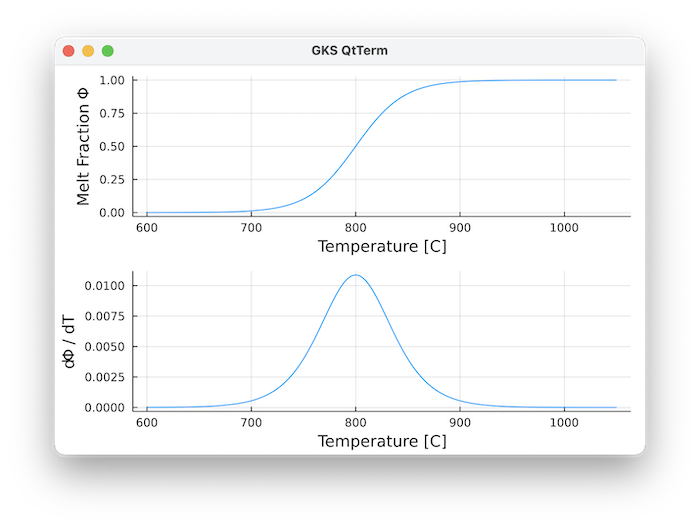
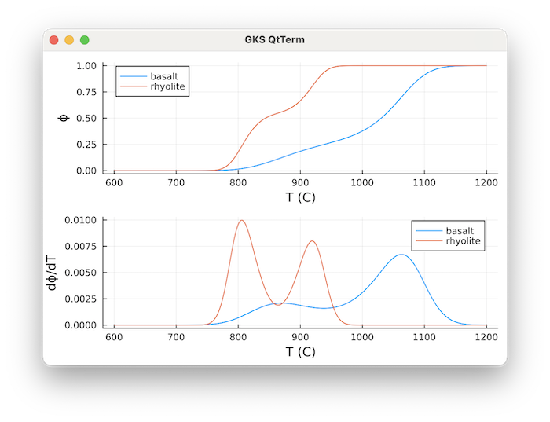
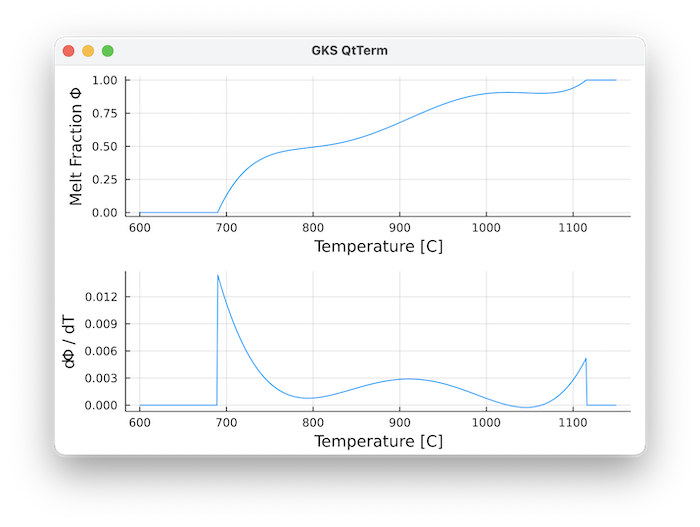
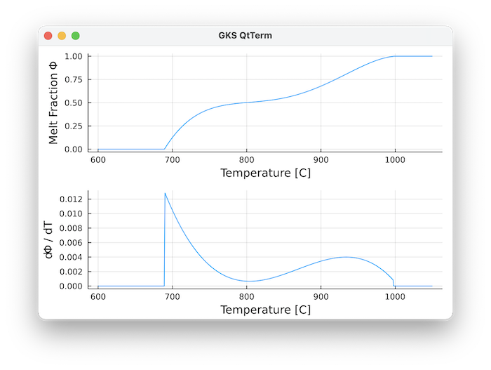
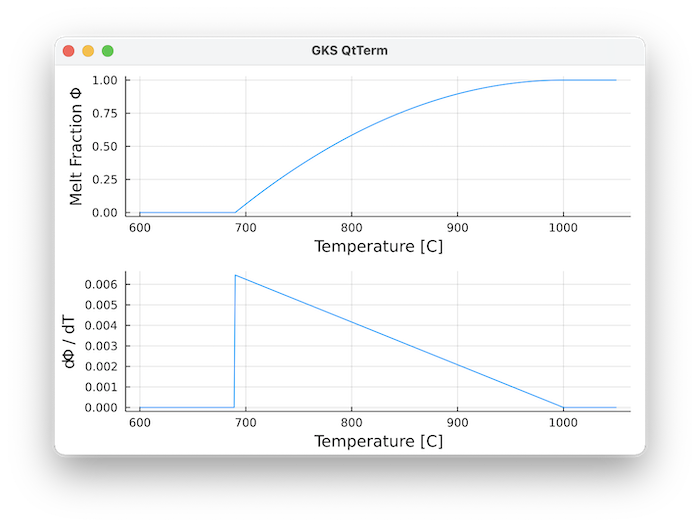
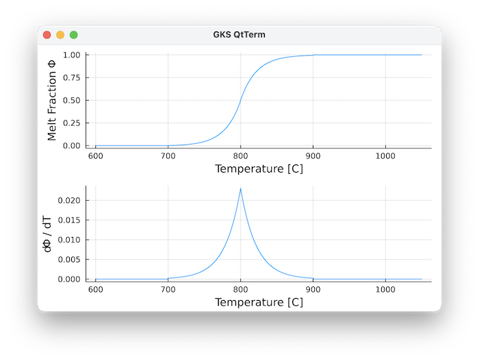
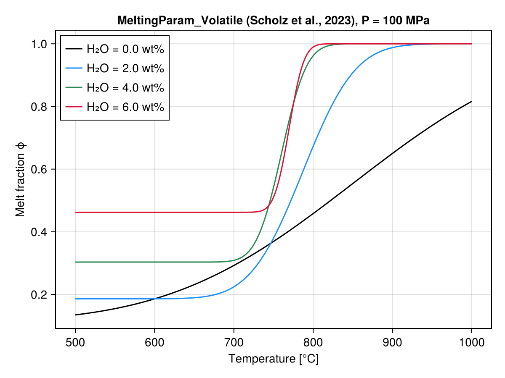
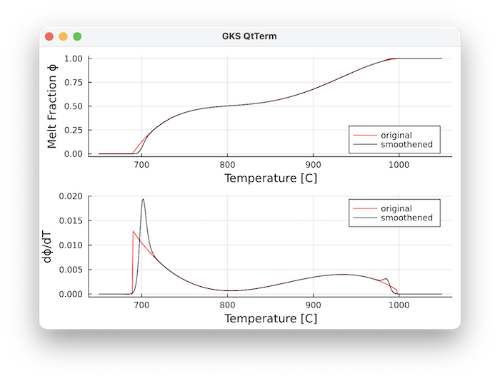

---
---

# Melting Parameterizations {#Melting-Parameterizations}

## Methods {#Methods}

A number of melting parameterisations are implemented, which can be set with:
<details class='jldocstring custom-block' open>
<summary><a id='GeoParams.MeltingParam.MeltingParam_Caricchi' href='#GeoParams.MeltingParam.MeltingParam_Caricchi'><span class="jlbinding">GeoParams.MeltingParam.MeltingParam_Caricchi</span></a> <Badge type="info" class="jlObjectType jlType" text="Type" /></summary>


```julia
MeltingParam_Caricchi()
```


Implements the T-dependent melting parameterisation used by Caricchi, Simpson et al. (as for example described in Simpson)

$$    \theta = \frac{a - (T + c)}{b}$$

$$    \phi_{melt} = \frac{1.0}{1.0 + e^\theta}$$

Note that T is in Kelvin. As default parameters we employ:

$$b=23K,  a=800K , c=273.15K$$

Which gives a reasonable fit to experimental data of granodioritic composition (Piwinskii and Wyllie, 1968):





**References**
- Simpson G. (2017) Practical finite element modelling in Earth Sciences Using MATLAB.
  


<Badge type="info" class="source-link" text="source"><a href="https://github.com/JuliaGeodynamics/GeoParams.jl/blob/fe1e2fd766bac30f9615d0d78f80f1e017d794a0/src/MeltFraction/MeltingParameterization.jl#L38-L60" target="_blank" rel="noreferrer">source</a></Badge>

</details>

<details class='jldocstring custom-block' open>
<summary><a id='GeoParams.MeltingParam.MeltingParam_Smooth3rdOrder' href='#GeoParams.MeltingParam.MeltingParam_Smooth3rdOrder'><span class="jlbinding">GeoParams.MeltingParam.MeltingParam_Smooth3rdOrder</span></a> <Badge type="info" class="jlObjectType jlType" text="Type" /></summary>


```julia
MeltingParam_Smooth3rdOrder()
```


Implements the a smooth 3rd order T-dependent melting parameterisation (as used by Melnik and coworkers)

$$    x = \frac{T - 273.15}{1000.0}$$

$$    \theta = { a + b * x + c * x^2 + d * x^3}$$

$$    \phi_{melt} = \frac{1.0}{1.0 + e^\theta}$$

Note that T is in Kelvin.

As default parameters we employ:

$$a=517.9,  b=-1619.0, c=1699.0, d = -597.4$$

which gives a reasonable fit to experimental data for basalt.

Data for rhyolite are:

$$a=3043.0,  b=-10552.0, c=12204.9, d = -4709.0$$



 Red: Rhyolite, Blue: Basalt

**References**


<Badge type="info" class="source-link" text="source"><a href="https://github.com/JuliaGeodynamics/GeoParams.jl/blob/fe1e2fd766bac30f9615d0d78f80f1e017d794a0/src/MeltFraction/MeltingParameterization.jl#L100-L131" target="_blank" rel="noreferrer">source</a></Badge>

</details>

<details class='jldocstring custom-block' open>
<summary><a id='GeoParams.MeltingParam.MeltingParam_5thOrder' href='#GeoParams.MeltingParam.MeltingParam_5thOrder'><span class="jlbinding">GeoParams.MeltingParam.MeltingParam_5thOrder</span></a> <Badge type="info" class="jlObjectType jlType" text="Type" /></summary>


```julia
MeltingParam_5thOrder(a,b,c,d,e,f,T_s,T_l)
```


Uses a 5th order polynomial to describe the melt fraction `phi` between solidus temperature `T_s` and liquidus temperature `T_l`

$$    \phi = a T^5 + b T^4 + c T^3 + d T^2 + e T + f  \textrm{   for   } T_s ≤ T ≤ T_l$$

$$    \phi = 1  \textrm{   if   } T>T_l$$

$$    \phi = 0  \textrm{   if   } T<T_s$$

Temperature `T` is in Kelvin.





The default values are for a composite liquid-line-of-descent:
- the upper part is for Andesite from: (Blatter, D. L. & Carmichael, I. S. (2001) Hydrous phase equilibria of a Mexican highsilica andesite: a candidate for a mantle origin? Geochim. Cosmochim. Acta 65, 4043–4065
  
- the lower part is extrapolated to the granitic minimum using the Marxer & Ulmer LLD for Andesite (Marxer, F. & Ulmer, P. (2019) Crystallisation and zircon saturation of calc-alkaline tonalite from the Adamello Batholith at upper crustal conditions: an experimental study. _Contributions Mineral. Petrol._ 174, 84)
  


<Badge type="info" class="source-link" text="source"><a href="https://github.com/JuliaGeodynamics/GeoParams.jl/blob/fe1e2fd766bac30f9615d0d78f80f1e017d794a0/src/MeltFraction/MeltingParameterization.jl#L183-L204" target="_blank" rel="noreferrer">source</a></Badge>

</details>

<details class='jldocstring custom-block' open>
<summary><a id='GeoParams.MeltingParam.MeltingParam_4thOrder' href='#GeoParams.MeltingParam.MeltingParam_4thOrder'><span class="jlbinding">GeoParams.MeltingParam.MeltingParam_4thOrder</span></a> <Badge type="info" class="jlObjectType jlType" text="Type" /></summary>


```julia
MeltingParam_4thOrder(b,c,d,e,f,T_s,T_l)
```


Uses a 4th order polynomial to describe the melt fraction `phi` between solidus temperature `T_s` and liquidus temperature `T_l`

$$    \phi = b T^4 + c T^3 + d T^2 + e T + f  \textrm{   for   } T_s ≤ T ≤ T_l$$

$$    \phi = 1 \textrm{   if   } T>T_l$$

$$    \phi = 0  \textrm{   if   } T<T_s$$

Temperature `T` is in Kelvin.





The default values are for Tonalite experiments from Marxer and Ulmer (2019):
- Marxer, F. & Ulmer, P. (2019) Crystallisation and zircon saturation of calc-alkaline tonalite from the Adamello Batholith at upper crustal conditions: an experimental study. _Contributions Mineral. Petrol._ 174, 84
  


<Badge type="info" class="source-link" text="source"><a href="https://github.com/JuliaGeodynamics/GeoParams.jl/blob/fe1e2fd766bac30f9615d0d78f80f1e017d794a0/src/MeltFraction/MeltingParameterization.jl#L267-L287" target="_blank" rel="noreferrer">source</a></Badge>

</details>

<details class='jldocstring custom-block' open>
<summary><a id='GeoParams.MeltingParam.MeltingParam_Quadratic' href='#GeoParams.MeltingParam.MeltingParam_Quadratic'><span class="jlbinding">GeoParams.MeltingParam.MeltingParam_Quadratic</span></a> <Badge type="info" class="jlObjectType jlType" text="Type" /></summary>


```julia
MeltingParam_Quadratic(T_s,T_l)
```


Quadratic melt fraction parameterisation where melt fraction $\phi$ depends only on solidus ($T_s$) and liquidus ($T_l$) temperature:

$$    \phi = 1.0 - \left( \frac{T_l - T}{T_l - T_s} \right)^2$$

$$    \phi = 1.0 \textrm{ if } T>T_l$$

$$    \phi = 0.0 \textrm{ if } T<T_s$$

Temperature `T` is in Kelvin.





This was used, among others, in Tierney et al. (2016) Geology


<Badge type="info" class="source-link" text="source"><a href="https://github.com/JuliaGeodynamics/GeoParams.jl/blob/fe1e2fd766bac30f9615d0d78f80f1e017d794a0/src/MeltFraction/MeltingParameterization.jl#L354-L373" target="_blank" rel="noreferrer">source</a></Badge>

</details>

<details class='jldocstring custom-block' open>
<summary><a id='GeoParams.MeltingParam.MeltingParam_Assimilation' href='#GeoParams.MeltingParam.MeltingParam_Assimilation'><span class="jlbinding">GeoParams.MeltingParam.MeltingParam_Assimilation</span></a> <Badge type="info" class="jlObjectType jlType" text="Type" /></summary>


```julia
MeltingParam_Assimilation(T_s,T_l,a)
```


Melt fraction parameterisation that takes the assimilation of crustal host rocks into account, as used by Tierney et al. (2016) based upon a parameterisation of Spera and Bohrson (2001)

Here, the fraction of molten and assimilated host rocks $\phi$ depends on the solidus ($T_s$) and liquidus ($T_l$) temperatures of the rocks, as well as on a parameter $a=0.005$

$$    X = \frac{T - T_s}{T_l - T_s}$$

$$    \phi = a \cdot \left( \exp^{2ln(100)X} - 1.0 \right) \textrm{ if } X ≤ 0.5$$

$$    \phi = 1- a \cdot \exp^{2ln(100)(1-X)}  \textrm{ if } X > 0.5$$

$$    \phi = 1.0 \textrm{ if } T>T_l$$

$$    \phi = 0.0 \textrm{ if } T<T_s$$

Temperature `T` is in Kelvin.





This was used, among others, in Tierney et al. (2016), who employed as default parameters:

$$   T_s=973.15, T_l=1173.15, a=0.005$$

**References**
- Spera, F.J., and Bohrson, W.A., 2001, Energy-Constrained Open-System Magmatic Processes I: General Model and Energy-Constrained Assimilation and Fractional Crystallization (EC- AFC) Formulation: Journal of Petrology, v. 42, p. 999–1018.
  
- Tierney, C.R., Schmitt, A.K., Lovera, O.M., de Silva, S.L., 2016. Voluminous plutonism during volcanic quiescence revealed by thermochemical modeling of zircon. Geology 44, 683–686. https://doi.org/10.1130/G37968.1
  


<Badge type="info" class="source-link" text="source"><a href="https://github.com/JuliaGeodynamics/GeoParams.jl/blob/fe1e2fd766bac30f9615d0d78f80f1e017d794a0/src/MeltFraction/MeltingParameterization.jl#L422-L457" target="_blank" rel="noreferrer">source</a></Badge>

</details>

<details class='jldocstring custom-block' open>
<summary><a id='GeoParams.MeltingParam.MeltingParam_Volatile' href='#GeoParams.MeltingParam.MeltingParam_Volatile'><span class="jlbinding">GeoParams.MeltingParam.MeltingParam_Volatile</span></a> <Badge type="info" class="jlObjectType jlType" text="Type" /></summary>


```julia
MeltingParam_Volatile(; a_coeffs, b_coeffs, c_coeffs, T0=273K, Tref=1K, Pref=1e6Pa)
```


Volatile-dependent silicic crystallinity-temperature curve fitted by Scholz et al. (2023) to rhyolite-MELTS runs, for use in Degruyter & Huber (2014)-type magma-chamber box models. The crystal fraction follows a complementary error function whose amplitude `a`, width `b`, and centre `c` depend on the dissolved water and CO2 contents and pressure:

$$    \varepsilon_x = a\,\mathrm{erfc}\!\big(b\,(T_C - c)\big),
    \qquad \phi = 1 - \varepsilon_x$$

with $T_C = (T - T_0)/T_{ref}$ (numerically °C) and each of $a, b, c$ a quadratic polynomial in $x = 100\,m_{H_2O}$, $y = 100\,m_{CO_2}$ (dissolved mass fractions, in wt%) and $z = P/P_{ref}$ (numerically MPa). Dissolved water depresses the liquidus, so more water shifts the curve to lower temperature. The returned quantity is the **melt fraction** $\phi$; the exsolved-gas fraction $\varepsilon_g$ is a solver state and is not subtracted here.

The fit is calibrated only over crystal fractions from 0 up to ~0.5-0.6 (the "eruptible" range these box models track); `2a` is the crystal fraction at the cold end of the fit and is bounded to `[0.5, 1]` by construction, so `ϕ` has a positive floor `1 - 2a` rather than reaching 0 — this is intentional, not a missing clamp.

The dimensionless polynomial coefficients are stored as plain `NTuple`s; only the reference scales `T0`, `Tref`, `Pref` are `GeoUnit`s, so the parameterisation nondimensionalizes. Dissolved contents `mH2O`, `mCO2` are dimensionless and pass through `args`.





**References**
- Scholz, K., Townsend, M., Huber, C., Troch, J., Bachmann, O., Coonin, A.N. (2023), Investigating the impact of an exsolved H2O-CO2 phase on magma chamber growth and longevity: A thermomechanical model, G-cubed 24, e2023GC011151, https://doi.org/10.1029/2023GC011151 (Eq. 9-12, silicic crystallinity-temperature curve)
  
- Degruyter, W., Huber, C. (2014), A model for the eruption frequency of upper crustal silicic magma chambers, EPSL 403, 117-130, https://doi.org/10.1016/j.epsl.2014.06.047
  


<Badge type="info" class="source-link" text="source"><a href="https://github.com/JuliaGeodynamics/GeoParams.jl/blob/fe1e2fd766bac30f9615d0d78f80f1e017d794a0/src/MeltFraction/MeltingParameterization.jl#L687-L722" target="_blank" rel="noreferrer">source</a></Badge>

</details>

<details class='jldocstring custom-block' open>
<summary><a id='GeoParams.MeltingParam.MeltingParam_MaficVolatile' href='#GeoParams.MeltingParam.MeltingParam_MaficVolatile'><span class="jlbinding">GeoParams.MeltingParam.MeltingParam_MaficVolatile</span></a> <Badge type="info" class="jlObjectType jlType" text="Type" /></summary>


```julia
MeltingParam_MaficVolatile(; a_coeffs, b_coeffs, T0=273K, Tref=1K, Pref=1e6Pa)
```


Volatile-dependent mafic crystallinity-temperature curve fitted by Scholz et al. (2023) to rhyolite-MELTS runs, for use in Degruyter & Huber (2014)-type magma-chamber box models: linear in temperature, `ε_x = a*T_C + b`, with slope `a` and intercept `b` each a degree-2 polynomial in `(100*mH2O, 100*mCO2, P/Pref)` — the same polynomial form as [`MeltingParam_Volatile`](/man/melting#GeoParams.MeltingParam.MeltingParam_Volatile)'s `a`/`b`/`c`, just combined linearly instead of through `erfc`. `ϕ = 1 - ε_x` (`ε_g` is added by the solver, not here).

A linear model has no saturation, so `ε_x` leaves `[0,1]` outside a narrow temperature window (~100-200 K wide; at 200 MPa: 1337-1443 K dry, 1221-1436 K at 1 wt% H2O, 1010-1417 K at 2 wt%). `compute_meltfraction` clamps `ε_x` to `[0,1]` there instead of returning it as computed:
- colder than the window, the fit predicts $\varepsilon_x > 1$, clamped to $1$ ($\phi=0$, fully solid);
  
- hotter than the window, it predicts $\varepsilon_x < 0$, clamped to $0$ ($\phi=1$, fully liquid).
  

Both clamps are the physically sensible reading, but the value is still an extrapolation past the fit's calibration, not a measurement — no warning is raised when this triggers.

**References**
- Scholz, K., Townsend, M., Huber, C., Troch, J., Bachmann, O., Coonin, A.N. (2023), Investigating the impact of an exsolved H2O-CO2 phase on magma chamber growth and longevity: A thermomechanical model, G-cubed 24, e2023GC011151, https://doi.org/10.1029/2023GC011151 (Eq. 14-16, mafic crystallinity-temperature curve)
  
- Degruyter, W., Huber, C. (2014), A model for the eruption frequency of upper crustal silicic magma chambers, EPSL 403, 117-130, https://doi.org/10.1016/j.epsl.2014.06.047
  


<Badge type="info" class="source-link" text="source"><a href="https://github.com/JuliaGeodynamics/GeoParams.jl/blob/fe1e2fd766bac30f9615d0d78f80f1e017d794a0/src/MeltFraction/MeltingParameterization.jl#L797-L826" target="_blank" rel="noreferrer">source</a></Badge>

</details>

<details class='jldocstring custom-block' open>
<summary><a id='GeoParams.MeltingParam.SmoothMelting' href='#GeoParams.MeltingParam.SmoothMelting'><span class="jlbinding">GeoParams.MeltingParam.SmoothMelting</span></a> <Badge type="info" class="jlObjectType jlType" text="Type" /></summary>


```julia
SmoothMelting(; p=MeltingParam_4thOrder(), k_sol=0.2/K,  k_liq=0.2/K)
```


This smoothens the melting parameterisation $p$ around the solidus $T_{sol}$ and liquidus $T_{liq}$ using a smoothened Heaviside step functions for the solidus:

$$    H_{sol} =  \frac{1.0}{1 + \exp\left(-2 k_{sol} \left(T - T_{sol} - \frac{2}{k_{sol}}\right)\right)}$$

and liquidus:

$$    H_{liq} =  1.0 - \frac{1.0}{1 + \exp\left(-2 k_{liq} \left(T - T_{liq} + \frac{2}{k_{liq}}\right)\right)}$$

The resulting melt fraction $\phi$ is computed from the original melt fraction $\phi_0$ (computed using one of the methods above) as:

$$    \phi =  \phi_0 H_{sol} H_{liq} + 1.0 - H_{liq}$$

The width of the smoothening zones is controlled by $k_{sol}, k_{liq}$ (larger values = sharper boundary).

This is important, as jumps in the derivative $dϕ/dT$ can cause numerical instabilities in latent heat computations, which is prevented with this smoothening.

**Example**

Let's consider a 4th order parameterisation:

```julia
julia> using GLMakie, GeoParams
julia> p = MeltingParam_4thOrder();
julia> T= collect(650.0:1:1050.) .+ 273.15;
julia> T,phi,dϕdT =  PlotMeltFraction(p,T=T);
```


The same but with smoothening:

```julia
julia> p_s = SmoothMelting(p=MeltingParam_4thOrder(), k_liq=0.21/K);
4th order polynomial melting curve: phi = -7.594512597174117e-10T^4 + 3.469192091489447e-6T^3 + -0.00592352980926T^2 + 4.482855645604745T + -1268.730161921053  963.15 K ≤ T ≤ 1270.15 K with smooth Heaviside function smoothening using k_sol=0.1 K⁻¹·⁰, k_liq=0.11 K⁻¹·⁰
julia> T_s,phi_s,dϕdT_s =  PlotMeltFraction(p_s,T=T);
```


We can create plots of this with:

```julia
julia> plt1 = plot(T.-273.15, phi, ylabel="Melt Fraction ϕ", color=:red, label="original", xlabel="Temperature [C]")
julia> plt1 = plot(plt1, T.-273.15, phi_s,  color=:black, label="smoothened", legend=:bottomright)
julia> plt2 = plot(T.-273.15, dϕdT, ylabel="dϕ/dT", color=:red, label="original", xlabel="Temperature [C]")
julia> plt2 = plot(plt2, T.-273.15, dϕdT_s,  color=:black, label="smoothened", legend=:topright)
julia> plot!(plt1,plt2,   xlabel="Temperature [C]", layout=(2,1))
```


The derivative no longer has a jump now:





<Badge type="info" class="source-link" text="source"><a href="https://github.com/JuliaGeodynamics/GeoParams.jl/blob/fe1e2fd766bac30f9615d0d78f80f1e017d794a0/src/MeltFraction/MeltingParameterization.jl#L564-L615" target="_blank" rel="noreferrer">source</a></Badge>

</details>


## Computational routines {#Computational-routines}

To compute the melt fraction at given `T` and `P`, use:
<details class='jldocstring custom-block' open>
<summary><a id='GeoParams.MeltingParam.compute_meltfraction!' href='#GeoParams.MeltingParam.compute_meltfraction!'><span class="jlbinding">GeoParams.MeltingParam.compute_meltfraction!</span></a> <Badge type="info" class="jlObjectType jlFunction" text="Function" /></summary>


```julia
compute_meltfraction!(ϕ::AbstractArray{<:AbstractFloat}, P::AbstractArray{<:AbstractFloat},T:AbstractArray{<:AbstractFloat}, p::AbstractPhaseDiagramsStruct)
```


In-place computation of melt fraction in case we use a phase diagram lookup table. The table should have the column `:meltFrac` specified.


<Badge type="info" class="source-link" text="source"><a href="https://github.com/JuliaGeodynamics/GeoParams.jl/blob/fe1e2fd766bac30f9615d0d78f80f1e017d794a0/src/MeltFraction/MeltingParameterization.jl#L906-L910" target="_blank" rel="noreferrer">source</a></Badge>


```julia
compute_meltfraction(ϕ::AbstractArray{<:AbstractFloat}, Phases::AbstractArray{<:Integer}, P::AbstractArray{<:AbstractFloat},T::AbstractArray{<:AbstractFloat}, MatParam::AbstractArray{<:AbstractMaterialParamsStruct})
```


In-place computation of melt fraction ϕ for the whole domain and all phases, in case an array with phase properties `MatParam` is provided, along with `P` and `T` arrays.


<Badge type="info" class="source-link" text="source"><a href="https://github.com/JuliaGeodynamics/GeoParams.jl/blob/fe1e2fd766bac30f9615d0d78f80f1e017d794a0/src/MeltFraction/MeltingParameterization.jl#L998-L1002" target="_blank" rel="noreferrer">source</a></Badge>

</details>

<details class='jldocstring custom-block' open>
<summary><a id='GeoParams.MeltingParam.compute_meltfraction' href='#GeoParams.MeltingParam.compute_meltfraction'><span class="jlbinding">GeoParams.MeltingParam.compute_meltfraction</span></a> <Badge type="info" class="jlObjectType jlFunction" text="Function" /></summary>


```julia
compute_meltfraction(P,T, p::AbstractPhaseDiagramsStruct)
```


Computes melt fraction in case we use a phase diagram lookup table. The table should have the column `:meltFrac` specified.


<Badge type="info" class="source-link" text="source"><a href="https://github.com/JuliaGeodynamics/GeoParams.jl/blob/fe1e2fd766bac30f9615d0d78f80f1e017d794a0/src/MeltFraction/MeltingParameterization.jl#L894-L898" target="_blank" rel="noreferrer">source</a></Badge>


```julia
ϕ = compute_meltfraction(Phases::AbstractArray{<:Integer}, P::AbstractArray{<:AbstractFloat},T::AbstractArray{<:AbstractFloat}, MatParam::AbstractArray{<:AbstractMaterialParamsStruct})
```


Computation of melt fraction ϕ for the whole domain and all phases, in case an array with phase properties `MatParam` is provided, along with `P` and `T` arrays.


<Badge type="info" class="source-link" text="source"><a href="https://github.com/JuliaGeodynamics/GeoParams.jl/blob/fe1e2fd766bac30f9615d0d78f80f1e017d794a0/src/MeltFraction/MeltingParameterization.jl#L990-L994" target="_blank" rel="noreferrer">source</a></Badge>

</details>


You can also obtain the derivative of melt fraction versus temperature with (useful to compute latent heat effects):
<details class='jldocstring custom-block' open>
<summary><a id='GeoParams.MeltingParam.compute_dϕdT!' href='#GeoParams.MeltingParam.compute_dϕdT!'><span class="jlbinding">GeoParams.MeltingParam.compute_dϕdT!</span></a> <Badge type="info" class="jlObjectType jlFunction" text="Function" /></summary>


```julia
compute_dϕdT!(ϕ::AbstractArray{<:AbstractFloat}, Phases::AbstractArray{<:Integer}, P::AbstractArray{<:AbstractFloat},T::AbstractArray{<:AbstractFloat}, MatParam::AbstractArray{<:AbstractMaterialParamsStruct})
```


Computes the derivative of melt fraction `ϕ` versus temperature `T`, `\frac{\partial \phi}{\partial T}` for the whole domain and all phases, in case an array with phase properties `MatParam` is provided, along with `P` and `T` arrays. This is employed, for example, in computing latent heat terms in an implicit manner.


<Badge type="info" class="source-link" text="source"><a href="https://github.com/JuliaGeodynamics/GeoParams.jl/blob/fe1e2fd766bac30f9615d0d78f80f1e017d794a0/src/MeltFraction/MeltingParameterization.jl#L1023-L1028" target="_blank" rel="noreferrer">source</a></Badge>

</details>

<details class='jldocstring custom-block' open>
<summary><a id='GeoParams.MeltingParam.compute_dϕdT' href='#GeoParams.MeltingParam.compute_dϕdT'><span class="jlbinding">GeoParams.MeltingParam.compute_dϕdT</span></a> <Badge type="info" class="jlObjectType jlFunction" text="Function" /></summary>


```julia
compute_dϕdT(P,T, p::AbstractPhaseDiagramsStruct)
```


Computes derivative of melt fraction vs T in case we use a phase diagram lookup table. The table should have the column `:meltFrac` specified. The derivative is computed by finite differencing.


<Badge type="info" class="source-link" text="source"><a href="https://github.com/JuliaGeodynamics/GeoParams.jl/blob/fe1e2fd766bac30f9615d0d78f80f1e017d794a0/src/MeltFraction/MeltingParameterization.jl#L913-L918" target="_blank" rel="noreferrer">source</a></Badge>


```julia
ϕ = compute_dϕdT(Phases::AbstractArray{<:Integer}, P::AbstractArray{<:AbstractFloat},T::AbstractArray{<:AbstractFloat}, MatParam::AbstractArray{<:AbstractMaterialParamsStruct})
```


Computates the derivative of melt fraction ϕ versus temperature `T` for the whole domain and all phases, in case an array with phase properties `MatParam` is provided, along with `P` and `T` arrays. This is employed in computing latent heat terms in an implicit manner, for example


<Badge type="info" class="source-link" text="source"><a href="https://github.com/JuliaGeodynamics/GeoParams.jl/blob/fe1e2fd766bac30f9615d0d78f80f1e017d794a0/src/MeltFraction/MeltingParameterization.jl#L1015-L1020" target="_blank" rel="noreferrer">source</a></Badge>

</details>


Also note that phase diagrams can be imported using `PerpleX_LaMEM_Diagram`, which may also have melt content information. The computational routines work with that as well.

# Plotting routines {#Plotting-routines}

You can use the routine `PlotMeltFraction` to create a plot, provided that the `GLMakie` package has been loaded
<details class='jldocstring custom-block' open>
<summary><a id='GeoParams.PlotMeltFraction' href='#GeoParams.PlotMeltFraction'><span class="jlbinding">GeoParams.PlotMeltFraction</span></a> <Badge type="info" class="jlObjectType jlFunction" text="Function" /></summary>


```julia
T, phi, dϕdT = PlotMeltFraction(p::AbstractMeltingParam; T=nothing, P=nothing, fig=nothing, lbl=nothing, filename=nothing)
```


Creates a plot of temperature `T` vs. melt fraction (top) and `dϕ/dT` (bottom), as specified in `p`. The 1D curve can be evaluated at a specific pressure `P` which can be given as a scalar or as an array of the same size as `T`. Note: if you want to create plots you need to install and load a `Makie.jl` backend (e.g. `GLMakie.jl` or, for headless use, `CairoMakie.jl`).

**Optional parameters**
- `T`: temperature range
  
- `P`: pressure
  
- `fig`: a previously generated figure to plot into
  
- `lbl`: label of the curve
  
- `filename`: if provided, the figure is saved to this file instead of being displayed
  

**Example**

```
julia> using CairoMakie, GeoParams
julia> p = MeltingParam_Caricchi()
julia> T, phi, dϕdT = PlotMeltFraction(p)
```


<Badge type="info" class="source-link" text="source"><a href="https://github.com/JuliaGeodynamics/GeoParams.jl/blob/fe1e2fd766bac30f9615d0d78f80f1e017d794a0/src/Plotting/Plotting.jl#L707-L727" target="_blank" rel="noreferrer">source</a></Badge>

</details>

