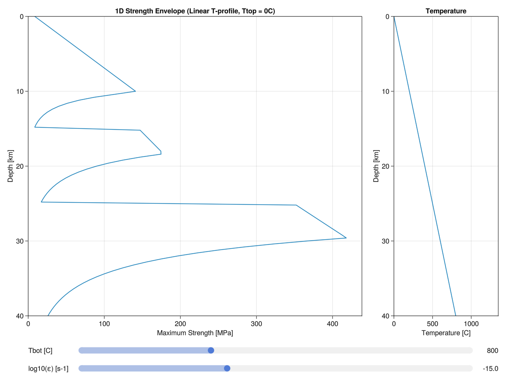

---
---

# 1D Strength envelope {#1D-Strength-envelope}

We provide a routine for computing a 1D strength envelope and the tools for setting up a temperature structure and lithostatic pressure profile.
<details class='jldocstring custom-block' open>
<summary><a id='GeoParams.ConstTemp' href='#GeoParams.ConstTemp'><span class="jlbinding">GeoParams.ConstTemp</span></a> <Badge type="info" class="jlObjectType jlType" text="Type" /></summary>


```julia
ConstTemp(T=1000)
```


Sets a constant temperature inside the box

Parameters:
- T : the value
  


<Badge type="info" class="source-link" text="source"><a href="https://github.com/JuliaGeodynamics/GeoParams.jl/blob/1a8e4f8dddc2ccb8a3f977ae466234307cc4b304/src/StrengthEnvelope/StrengthEnvelope.jl#L8-L15" target="_blank" rel="noreferrer">source</a></Badge>

</details>

<details class='jldocstring custom-block' open>
<summary><a id='GeoParams.LinTemp' href='#GeoParams.LinTemp'><span class="jlbinding">GeoParams.LinTemp</span></a> <Badge type="info" class="jlObjectType jlType" text="Type" /></summary>


```julia
LinTemp(Ttop=0, Tbot=1000)
```


Sets a linear temperature structure from top to bottom

Parameters:
- Ttop: the value @ the top
  
- Tbot: the value @ the bottom
  


<Badge type="info" class="source-link" text="source"><a href="https://github.com/JuliaGeodynamics/GeoParams.jl/blob/1a8e4f8dddc2ccb8a3f977ae466234307cc4b304/src/StrengthEnvelope/StrengthEnvelope.jl#L33-L41" target="_blank" rel="noreferrer">source</a></Badge>

</details>

<details class='jldocstring custom-block' open>
<summary><a id='GeoParams.HalfspaceCoolTemp' href='#GeoParams.HalfspaceCoolTemp'><span class="jlbinding">GeoParams.HalfspaceCoolTemp</span></a> <Badge type="info" class="jlObjectType jlType" text="Type" /></summary>


```julia
HalfspaceCoolTemp(Tsurface=0, Tmantle=1350, Age=60, Adiabat=0)
```


Sets a halfspace temperature structure in plate

Parameters:
- Tsurface: surface temperature [C]
  
- Tmantle:  mantle temperature [C]
  
- Age:      Thermal Age of plate [Myr]
  
- Adiabat:  Mantle Adiabat [K/km]
  


<Badge type="info" class="source-link" text="source"><a href="https://github.com/JuliaGeodynamics/GeoParams.jl/blob/1a8e4f8dddc2ccb8a3f977ae466234307cc4b304/src/StrengthEnvelope/StrengthEnvelope.jl#L57-L67" target="_blank" rel="noreferrer">source</a></Badge>

</details>

<details class='jldocstring custom-block' open>
<summary><a id='GeoParams.CompTempStruct' href='#GeoParams.CompTempStruct'><span class="jlbinding">GeoParams.CompTempStruct</span></a> <Badge type="info" class="jlObjectType jlFunction" text="Function" /></summary>


```julia
CompTempStruct(Z, s::AbstractTempStruct)
```


Returns a temperature vector that matches the coordinate vector and temperature structure that were passed in

Parameters:
- Z: vector with depth coordinates
  
- s: Temperature structure (CostTemp, LinTemp, HalfspaceCoolTemp)
  


<Badge type="info" class="source-link" text="source"><a href="https://github.com/JuliaGeodynamics/GeoParams.jl/blob/1a8e4f8dddc2ccb8a3f977ae466234307cc4b304/src/StrengthEnvelope/StrengthEnvelope.jl#L21-L29" target="_blank" rel="noreferrer">source</a></Badge>

</details>

<details class='jldocstring custom-block' open>
<summary><a id='GeoParams.LithPres' href='#GeoParams.LithPres'><span class="jlbinding">GeoParams.LithPres</span></a> <Badge type="info" class="jlObjectType jlFunction" text="Function" /></summary>


```julia
LithPres(MatParam, Phases, ρ, T, dz, g)
```


Iteratively solves a 1D lithostatic pressure profile (compatible with temperature- and pressure-dependent densities)

Parameters:
- MatParam: a tuple of materials (including the following properties: Phase, Density)
  
- Phases:   vector with the distribution of phases
  
- ρ:        density vector for initial guess(can be zeros)
  
- T:        temperature vector
  
- dz:       grid spacing
  
- g:        gravitational acceleration
  


<Badge type="info" class="source-link" text="source"><a href="https://github.com/JuliaGeodynamics/GeoParams.jl/blob/1a8e4f8dddc2ccb8a3f977ae466234307cc4b304/src/StrengthEnvelope/StrengthEnvelope.jl#L89-L101" target="_blank" rel="noreferrer">source</a></Badge>

</details>

<details class='jldocstring custom-block' open>
<summary><a id='GeoParams.StrengthEnvelopeComp' href='#GeoParams.StrengthEnvelopeComp'><span class="jlbinding">GeoParams.StrengthEnvelopeComp</span></a> <Badge type="info" class="jlObjectType jlFunction" text="Function" /></summary>


```julia
StrengthEnvelopeComp(MatParam::NTuple{N, AbstractMaterialParamsStruct}, Thickness::Vector{U}, TempType::AbstractTempStruct=LinTemp(0C, 800C), ε=1e-15/s, nz::Int64=101) where {N, U}
```


Calculates a 1D strength envelope. Pressure used for Drucker Prager plasticity is lithostatic. To visualize the results in a GUI, use StrengthEnvelopePlot.

Parameters:
- MatParam:  a tuple of materials (including the following properties: Phase, Density, CreepLaws, Plasticity)
  
- Thickness: a vector listing the thicknesses of the respective layers (should carry units)
  
- TempType:  the type of temperature profile (ConstTemp(), LinTemp(), HalfspaceCoolTemp())
  
- ε:         background strainrate
  
- nz:        optional argument controlling the number of points along the profile (default = 101)
  

**Example:**

```julia
julia> using GLMakie
julia> MatParam = (SetMaterialParams(Name="UC", Phase=1, Density=ConstantDensity(ρ=2700kg/m^3), CreepLaws = SetDislocationCreep("Wet Quartzite | Ueda et al. (2008)"), Plasticity = DruckerPrager(ϕ=30.0, C=10MPa)),
                   SetMaterialParams(Name="MC", Phase=2, Density=Density=ConstantDensity(ρ=2900kg/m^3), CreepLaws = SetDislocationCreep("Plagioclase An75 | Ji and Zhao (1993)"), Plasticity = DruckerPrager(ϕ=20.0, C=10MPa)),
                   SetMaterialParams(Name="LC", Phase=3, Density=PT_Density(ρ0=2900kg/m^3, α=3e-5/K, β=1e-10/Pa), CreepLaws = SetDislocationCreep("Maryland strong diabase | Mackwell et al. (1998)"), Plasticity = DruckerPrager(ϕ=30.0, C=10MPa)));
julia> Thickness = [15,10,15]*km;

julia> StrengthEnvelopeComp(MatParam, Thickness, LinTemp(), ε=1e-15/s)
```


<Badge type="info" class="source-link" text="source"><a href="https://github.com/JuliaGeodynamics/GeoParams.jl/blob/1a8e4f8dddc2ccb8a3f977ae466234307cc4b304/src/StrengthEnvelope/StrengthEnvelope.jl#L161-L183" target="_blank" rel="noreferrer">source</a></Badge>

</details>

<details class='jldocstring custom-block' open>
<summary><a id='GeoParams.StrengthEnvelopePlot' href='#GeoParams.StrengthEnvelopePlot'><span class="jlbinding">GeoParams.StrengthEnvelopePlot</span></a> <Badge type="info" class="jlObjectType jlFunction" text="Function" /></summary>


```julia
StrengthEnvelopePlot(MatParam, Thickness; TempType, nz)
```


Requires GLMakie

Creates a GUI that plots a 1D strength envelope. In the GUI, temperature profile and strain rate can be adjusted. The Drucker-Prager plasticity uses lithostatic pressure.

Parameters:
- MatParam:  a tuple of materials (including the following properties: Phase, Density, CreepLaws, Plasticity)
  
- Thickness: a vector listing the thicknesses of the respective layers (should carry units)
  
- TempType:  the type of temperature profile (LinTemp=default, HalfspaceCoolTemp, ConstTemp)
  
- nz:        optional argument controlling the number of points along the profile (default = 101)
  

**Example:**

```julia
julia> using GLMakie
julia> MatParam = (SetMaterialParams(Name="UC", Phase=1, Density=ConstantDensity(ρ=2700kg/m^3), CreepLaws = SetDislocationCreep("Wet Quartzite | Ueda et al. (2008)"), Plasticity = DruckerPrager(ϕ=30.0, C=10MPa)),
                   SetMaterialParams(Name="MC", Phase=2, Density=Density=ConstantDensity(ρ=2900kg/m^3), CreepLaws = SetDislocationCreep("Plagioclase An75 | Ji and Zhao (1993)"), Plasticity = DruckerPrager(ϕ=20.0, C=10MPa)),
                   SetMaterialParams(Name="LC", Phase=3, Density=PT_Density(ρ0=2900kg/m^3, α=3e-5/K, β=1e-10/Pa), CreepLaws = SetDislocationCreep("Maryland strong diabase | Mackwell et al. (1998)"), Plasticity = DruckerPrager(ϕ=30.0, C=10MPa)));
julia> Thickness = [15,10,15]*km;

julia> StrengthEnvelopePlot(MatParam, Thickness, LinTemp())
```


<Badge type="info" class="source-link" text="source"><a href="https://github.com/JuliaGeodynamics/GeoParams.jl/blob/1a8e4f8dddc2ccb8a3f977ae466234307cc4b304/src/StrengthEnvelope/StrengthEnvelope.jl#L228-L251" target="_blank" rel="noreferrer">source</a></Badge>

</details>




