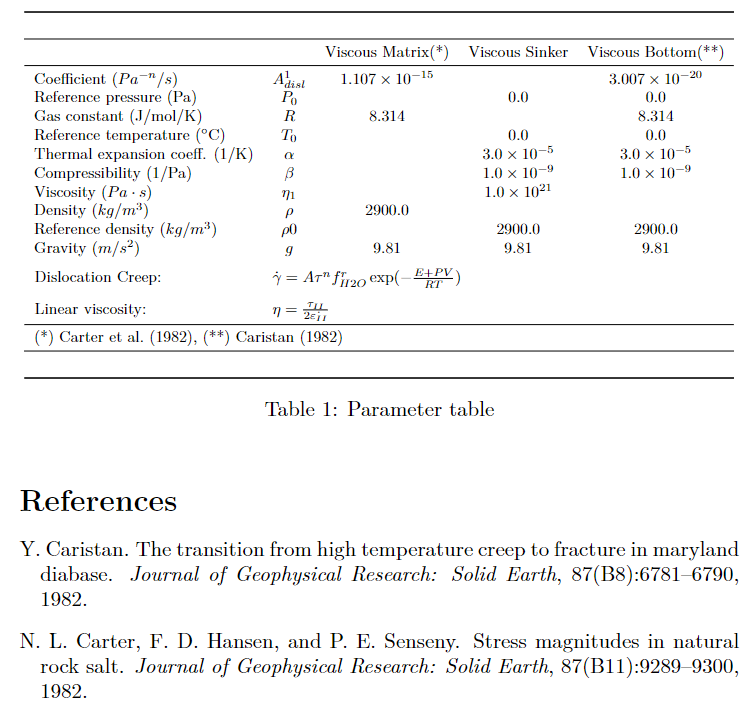
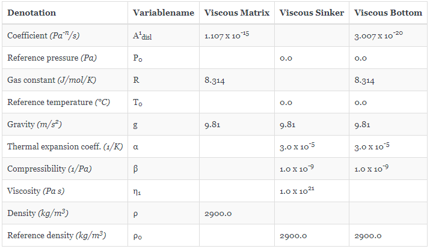

---
---

# Tables {#Tables}

There are two different formats of output tables that can be produced:
- LaTeX (always comes with "References.bib" for citations)
  
- Markdown
  

# Producing output table {#Producing-output-table}

`ParameterTable()` is used to produce an output table of all the material parameters in your phase(s) in LaTeX or Markdown format. All you need is a dimensional `phase` as defined in section 2. Material Parameters in the README.md of GeoParams. This `phase` should be given to `ParameterTable` as first argument. There are optional arguments which can be given in `ParameterTable`. Those are `format`, `filename` and `rdigits`. The `format` keyword determines whether your table should be in `LaTeX` or `Markdown` format (should be given as string). `filename` determines the name of the file but can also be used to save the file in a different directory other than the GeoParams package directory (should be given as string, note: no file endings needed since they will be determined by the `format` keyword!). `rdigits` gives the numbers of decimals to which all parameter values will be rounded (should be given as integer).

Example 1:

```julia
julia> MatParam = SetMaterialParams(Name="Viscous Matrix", Phase=1,
                                     Density   = ConstantDensity(),
                                     CreepLaws = LinearViscous(η=1e23Pa*s))

julia> ParameterTable(MatParam, format="tex", filename="ParameterTable", rdigits=4)
```





Example 2:

```julia
julia> ParameterTable(MatParam, format="md", filename="ParameterTable", rdigits=4)
```




<details class='jldocstring custom-block' open>
<summary><a id='GeoParams.Tables.ParameterTable' href='#GeoParams.Tables.ParameterTable'><span class="jlbinding">GeoParams.Tables.ParameterTable</span></a> <Badge type="info" class="jlObjectType jlFunction" text="Function" /></summary>


```julia
ParameterTable(phases; filename="ParameterTable", format="latex", rdigits=4)
```


Creates a table with all parameters from the material phases. Supports both LaTeX and Markdown formats.

**Arguments**
- `phases`: Material parameter phases (single phase or tuple of phases)
  
- `filename`: Output filename (without extension)
  
- `format`: Output format ("latex"/"tex" or "markdown"/"md")
  
- `rdigits`: Number of decimal places for rounding
  

**Examples**

```julia
# LaTeX table
ParameterTable(MatParam; format="latex", filename="MyTable")

# Markdown table
ParameterTable(MatParam; format="markdown", filename="MyTable")
```


<Badge type="info" class="source-link" text="source"><a href="https://github.com/JuliaGeodynamics/GeoParams.jl/blob/1a8e4f8dddc2ccb8a3f977ae466234307cc4b304/src/Tables.jl#L1396-L1416" target="_blank" rel="noreferrer">source</a></Badge>

</details>


::: warning Missing docstring.

Missing docstring for `GeoParams.Phase2Dict`. Check Documenter's build log for details.

:::

::: warning Missing docstring.

Missing docstring for `GeoParams.Phase2DictMd`. Check Documenter's build log for details.

:::
<details class='jldocstring custom-block' open>
<summary><a id='GeoParams.Tables.Dict2LatexTable' href='#GeoParams.Tables.Dict2LatexTable'><span class="jlbinding">GeoParams.Tables.Dict2LatexTable</span></a> <Badge type="info" class="jlObjectType jlFunction" text="Function" /></summary>


```julia
Dict2LatexTable(d::Dict, refs::Dict; filename="ParameterTable", rdigits=4)
```


Creates a LaTeX table from the parameter dictionary.


<Badge type="info" class="source-link" text="source"><a href="https://github.com/JuliaGeodynamics/GeoParams.jl/blob/1a8e4f8dddc2ccb8a3f977ae466234307cc4b304/src/Tables.jl#L657-L661" target="_blank" rel="noreferrer">source</a></Badge>

</details>

<details class='jldocstring custom-block' open>
<summary><a id='GeoParams.Tables.Dict2MarkdownTable' href='#GeoParams.Tables.Dict2MarkdownTable'><span class="jlbinding">GeoParams.Tables.Dict2MarkdownTable</span></a> <Badge type="info" class="jlObjectType jlFunction" text="Function" /></summary>


```julia
Dict2MarkdownTable(d::Dict; filename="ParameterTable", rdigits=4)
```


Creates a Markdown table from the parameter dictionary.


<Badge type="info" class="source-link" text="source"><a href="https://github.com/JuliaGeodynamics/GeoParams.jl/blob/1a8e4f8dddc2ccb8a3f977ae466234307cc4b304/src/Tables.jl#L1222-L1226" target="_blank" rel="noreferrer">source</a></Badge>

</details>

<details class='jldocstring custom-block' open>
<summary><a id='GeoParams.Tables.detachFloatfromExponent' href='#GeoParams.Tables.detachFloatfromExponent'><span class="jlbinding">GeoParams.Tables.detachFloatfromExponent</span></a> <Badge type="info" class="jlObjectType jlFunction" text="Function" /></summary>


```julia
detachFloatfromExponent(str::String) -> (Int, String, String)
```


Returns the number of decimal places, the number without exponent, and the exponent. Returns "1" for the exponent if the input number has no exponent.


<Badge type="info" class="source-link" text="source"><a href="https://github.com/JuliaGeodynamics/GeoParams.jl/blob/1a8e4f8dddc2ccb8a3f977ae466234307cc4b304/src/Tables.jl#L125-L130" target="_blank" rel="noreferrer">source</a></Badge>

</details>

